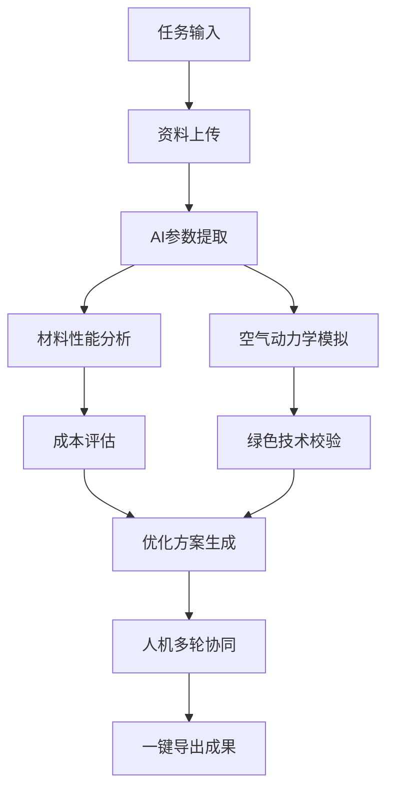

# 超级麦吉最佳实践案例深度拆解：中国商飞飞机设计师如何用AI Agent优化机翼设计

原创 AGI观察室 · 2025年8月

---

## 01. 背景介绍：国产大飞机设计师的AI生产力新范式

2025年，AI大模型与智能体Agent技术已在企业级场景实现广泛落地。中国商飞（COMAC）作为国内航空制造领域的核心企业，正在推动C929宽体客机的研发。面对日益严苛的绿色航空要求和全球市场竞争，机翼设计师们正寻求新一代数字化工具，以突破传统方法论的效率瓶颈。

本次案例，聚焦中国商飞飞机设计师赵刚，如何利用「超级麦吉 Super Magic」AI生产力平台，在机翼设计优化任务中，完成从需求输入、资料整合、方案生成到多轮人机协同的全流程实践。

---

## 02. 任务需求：机翼设计优化的多维挑战

赵刚的目标非常明确：

- **优化C929机翼设计**
    - **目标**：燃油效率提升5%，成本增幅不超过1%，兼顾绿色航空理念
    - **约束**：最大翼展68米，巡航马赫数0.85

这一需求既涉及空气动力学、材料性能、制造成本等工程硬指标，也需符合企业绿色低碳战略。任务复杂度高、数据维度多，传统Excel、CAD和人工方案讨论难以快速闭环。

---

## 03. 人机协同流程：超级麦吉Agent的应用全景

### Step 1. 任务输入与约束设定

赵刚通过超级麦吉的「项目模式」，在工作区新建项目，输入核心提示词：

> “优化C929机翼设计，目标：燃油效率↑5%，成本增幅≤1%，需兼顾商飞绿色航空理念。约束条件：最大翼展68m，巡航马赫数0.85。”

**系统自动识别任务类型、目标指标、约束条件，进入Agent思维链分析。**

### Step 2. 多源资料整合

赵刚将企业内部资料上传至麦吉项目空间：

| 文件名                          | 内容说明                                           | 用途示例               |
|---------------------------------|---------------------------------------------------|------------------------|
| COMAC_C929_TechnicalSpec.pdf    | 当前设计参数：翼展68m、空重121t、油箱容积140KL     | 优化基线               |
| COMAC_MaterialDB_2025.xlsx      | 材料库：T800复材抗拉强度5.8GPa，单价$215/kg        | 轻量化方案成本核算     |
| COMAC_Value_Handbook.md         | §3.2 优先选择全生命周期低碳技术                    | 绿色技术符合性验证     |
| supplier_quote_2025.csv         | 碳纤维预浸料-210/kg，铝合金-52/kg（虚拟报价）      | 材料成本对比           |
| intranet.comac.com/green2030    | “2030年目标：燃油效率较2020提升25%”                | 战略目标绑定           |

**麦吉文件系统支持@引用、全文搜索、知识库聚合，确保所有资料可被AI高效调用。**

### Step 3. AI Agent自动推理与方案生成

超级麦吉Agent基于多模态检索，自动完成以下流程：

1. **参数提取**：从技术规格文档中抽取机翼关键指标
2. **材料性能分析**：对比T800复材与铝合金的力学性能、成本、碳足迹
3. **空气动力学模拟**：调用公域数据库和最新论文，检索类似机型的优化案例
4. **制造成本评估**：结合供应商报价，计算不同材料方案的成本增幅
5. **企业价值观校验**：分析方案是否符合绿色航空和低碳技术要求
6. **战略目标对齐**：确保优化方案对齐2030年企业燃油效率提升目标

**麦吉Agent支持多步推理链，自动生成初步优化建议，并输出结构化报告。**

### Step 4. 多轮人机协同：实时迭代与控制

赵刚可在麦吉项目空间实时查看AI生成的阶段性结果：

- 机翼设计改进建议（如：采用新型复合材料减轻重量，优化翼型降低风阻）
- 材料成本对比表格
- 空气动力学性能仿真图表
- 绿色技术符合性分析
- 战略目标达成度评估

如有疑问或需调整，赵刚可直接在话题区与AI继续对话：

> “请重新评估T800复材方案，若成本增幅超过1%，是否有替代材料？”

Agent自动回溯、调整参数，生成新一轮方案。所有迭代过程均有版本管理，支持回溯与导出。

### Step 5. 一键导出与成果分享

项目完成后，赵刚可一键导出方案报告为PDF或PPT，直接用于团队评审或管理层汇报。所有数据、分析过程、决策依据均可追溯，极大提升了方案透明度与复用性。

---

## 04. 功能亮点复盘：超级麦吉在工程设计场景的优势

### 1. 三层项目结构，实现多维度并行协作

- **工作区 > 项目 > 话题**结构，支持多个设计任务同时推进
- 每个话题独立AI执行单元，灵活切换、无限迭代

### 2. 文件系统深度整合，资料调用高效可控

- 支持多源内容聚合、智能@引用、版本自动管理
- 明确数据归属，保障企业数据安全与可控

### 3. Agent多步推理链，方案生成科学透明

- 自动检索公域知识、行业论文，结合企业内部资料
- 多轮人机对话，支持实时调整与精细化控制

### 4. 专业模式加持，满足工程师深度需求

- 支持复杂数据分析、仿真结果可视化
- 结构化输出、自动生成图表与报告

### 5. 多端协同、插件生态，打通企业数字化链路

- 支持PC、移动端、网页端无缝切换
- 可接入OA、CRM、数据库、代码仓库等业务系统

---

## 05. 真实体验：工程师视角的麦吉Agent价值

> “在以往的设计流程中，资料查找、方案比对、数据分析都要靠人工反复操作，效率低且易出错。用上超级麦吉后，我只需输入目标和约束，所有资料自动整理，AI能主动生成多套改进方案。最重要的是，我可以随时参与决策、调整参数，整个过程透明可控，极大提升了团队协作效率。”  
—— 中国商飞C929机翼设计师 赵刚

---

## 06. 案例复盘：超级麦吉Agent赋能工程设计的流程图

*（如需插入流程图，请用Mermaid语法或替换为实际图片）*

---

## 07. 行业趋势与展望

随着AI Agent技术的成熟，工程设计、制造、管理等高复杂度场景正加速迈向「人机共创」模式。超级麦吉以开源、可控、可深度定制的特性，为企业级用户提供了从资料整合、智能推理、方案生成到多轮协同的全流程数字化能力。

对于航空制造、汽车研发、建筑设计等行业而言，AI Agent已不仅仅是辅助工具，更是团队数字化转型的核心引擎。工程师不再是信息处理的“苦力”，而成为AI军团的指挥官，将精力集中于创新与决策。

---

## 08. 总结：超级麦吉Agent的最佳实践方法论

- **明确任务目标与约束条件，输入清晰提示词**
- **上传多源资料，充分利用文件系统与知识库**
- **利用Agent多步推理链，自动生成多维度方案**
- **在人机协同区进行多轮对话，实时调整优化**
- **充分利用专业模式，生成结构化数据与报告**
- **一键导出成果，便于团队分享与复用**

超级麦吉Agent的应用，已在中国商飞等大型企业实现真实落地。对于希望提升生产力、实现数字化转型的行业高管、技术团队、投资人来说，这一最佳实践案例提供了可复制、可扩展的参考路径。

---

## 09. 相关链接与资源

- [超级麦吉官网（中国站）](https://www.letsmagic.cn)
- [超级麦吉国际站](https://www.letsmagic.ai)
- [GitHub项目地址](https://github.com/dtyq/magic)
- [官方文档中心](https://docs.letsmagic.cn)

---

## 10. 结语

AI Agent时代，工程师的角色正在重塑。以超级麦吉为代表的新一代生产力平台，正在成为企业创新、效率提升的关键驱动力。未来，更多行业场景将涌现类似的最佳实践案例，推动人机协同走向更高维度的智能化。

如果你也有类似的AI应用探索，欢迎在评论区分享你的实践经验。👇

---

**AGI观察室 · 持续关注企业级AI Agent落地案例，欢迎交流探讨！**