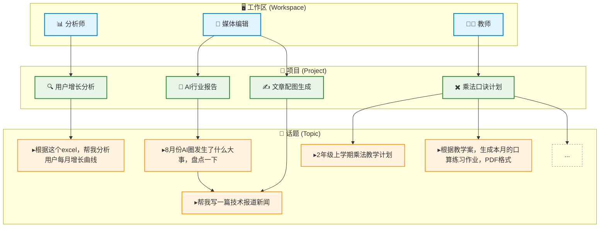

# 超级麦吉实测：95分钟直播5分钟总结，AI生产力平台真有这么高效？

2025年8月12日，开源中国（gitee）官方微信公众号OSC开源社区直播中，广东灯塔引擎科技有限公司的核心团队首次公开亮相，带来了他们最新迭代的AI生产力平台——“超级麦吉”。这场直播不仅吸引了大批技术圈观众，弹幕里甚至出现了“老公”这样的迷妹发言，足见创始团队在技术与个人魅力上的双重吸引力。👀

但我们关注的重点，还是超级麦吉这款产品的实际表现。毕竟，AI Agent赛道已然是兵家必争之地，谁能在“企业协同+智能体”领域跑出差异化，才是大家真正关心的。

---

## 直播现场速览：产品负责人首次亮相

本次直播不仅是超级麦吉团队的首次公开产品讲解，也是广东灯塔引擎科技有限公司在企业级AI领域的一次高调亮相。此前，业内一直有传闻他们在做企业协同和AI Agent相关项目，但鲜有详细信息披露。这次，团队核心成员亲自上阵，技术实力和产品理念一览无遗。

技术圈的朋友们可能对“开源中国”不陌生，作为国内最大的开发者社区之一，OSC直播间的观众质量和活跃度都非常高。超级麦吉团队的首次亮相，直接拉高了行业关注度。

---

## 产品体验：AI Agent的“工作区-项目-话题”三层结构

超级麦吉的核心理念，是用AI Agent模拟企业实际职能和协作流程。用户在平台中，先建立【工作区 Workspace】（对应一个职能岗位），再在工作区下建立【项目 Project】（对应具体任务），最后在项目中创建【话题 Topic】（具体需求或对话）。

这种分层设计，既契合了企业实际运作逻辑，也方便后续成果的保存与复用。对于AI和技术圈的小伙伴来说，这种结构化处理，兼顾了灵活性和可扩展性。

👇一张官方流程图，直观展示了超级麦吉的分层设计：

### 自动归档：AI像职场新人一样“记笔记”

一个细节值得点赞：即使用户没有主动建立层级结构，超级麦吉也会自动为每次对话分配【工作区】-【项目】-【话题】，并保存所有中间结果。这种“无感归档”，让AI像贴心的职场新人一样，自动帮你整理、归档、备份。对于技术团队来说，这种数据管理能力，能大幅提升后续复用效率。

---

## 实测“录音总结”：95分钟直播，5分钟出大纲

本次直播内容长达95分钟。我们把直播录音直接丢给超级麦吉的“录音总结”专家，看看它能否高效输出有价值的摘要。

操作流程非常简单：上传录音，选择“录音总结”专家，AI自动识别、转写、结构化输出。

结果只用了5分钟，超级麦吉就把95分钟的内容完整拆解、分段，并输出层级清晰的大纲。👇

对比市面上的垂类会议总结AI，超级麦吉的结果不仅结构清晰，内容覆盖也很全面。对于技术圈的朋友来说，会议纪要和录音总结一直是效率痛点，这种自动化能力，确实能帮团队节省大量时间。

---

## 一键生成PPT：结构化内容到演示文稿

会议总结之后，超级麦吉还能一键把结构化内容生成PPT。对于需要快速汇报、复盘的团队来说，这一功能非常实用。

PPT示例效果：

[此处是一个视频占位符]

内容结构完整，排版简洁，基本能满足大多数工作场景的需求。后续还可以在话题、项目、工作区中进一步加工，所有结果都会自动保存，方便随时查阅和复用。

---

## 数字员工的雏形：AI Agent能否成为团队“生产力引擎”？

随着文件和经验的积累，超级麦吉不仅能完成单次任务，更有望逐步成长为团队的“数字员工”。它能自动归档、复用历史成果，持续提升工作效率。技术团队如果善用这类AI Agent，未来有望把更多重复性、结构化的工作交给AI，专注于创造性和决策性任务。

从产品设计到工程实现，超级麦吉团队在AI能力的工程化上做了大量打磨。无论是自动分层归档，还是会议录音总结、PPT生成，都体现了对实际企业需求的深刻理解。

---

## 行业观察：AI Agent平台的进化与挑战

超级麦吉的发布，折射出AI Agent平台正在从“工具型AI”向“协作型AI”进化。过去，AI更多是单点工具，比如智能会议纪要、自动文档生成。现在，平台开始追求“端到端”协作能力，能自动归档、结构化、复用、演示，越来越像一个“数字员工”。

但挑战也不容忽视：

- **数据安全与隐私**：企业协同场景对数据安全要求极高，AI平台如何保障数据隔离和合规，是落地的关键。
- **多角色协同**：不同职能岗位的需求差异巨大，AI Agent如何兼容分析师、编辑、教师等多种角色，考验产品的泛化能力。
- **用户体验**：自动化归档、结构化输出虽好，但如果流程复杂、反馈不及时，反而会降低用户粘性。
- **行业适配**：不同垂类的专业要求（如医疗、金融、教育），对AI Agent的“专业度”提出更高要求。

超级麦吉的三层结构和自动归档能力，已经在一定程度上解决了部分协同痛点。但未来，如何实现更高水平的“人机协同”，依然是整个行业的技术挑战。

---

## 技术圈视角：产品迭代与团队风格

超级麦吉团队这次直播，不仅展示了产品实力，也展现了技术团队的开放与创新氛围。直播间的弹幕互动、团队成员的个人魅力，都让人感受到技术圈年轻人的活力和自信。

从工程实现到产品体验，超级麦吉正在用实际表现，推动AI Agent从“概念”走向“落地”。对于关注AI和企业协同的技术团队来说，这样的产品迭代值得持续关注。

---

## 结语：AI Agent能否成为“数字员工”？我们拭目以待

超级麦吉这次直播，不仅让我们看到了AI Agent在企业协同场景的实际落地，也让技术圈的小伙伴们有了更多对“数字员工”未来的想象空间。

录音总结、自动归档、一键PPT生成，这些功能看似简单，背后却是对企业实际需求的深刻洞察。超级麦吉团队在工程化上的持续打磨，也为整个AI Agent行业提供了宝贵的实践样本。

未来，AI Agent能否真正成为企业的“生产力引擎”？超级麦吉能否跑出更多差异化实践？我们会持续关注，也欢迎大家在评论区分享自己的体验和观点。

---

> 技术正在改变协作方式，AI Agent正在重塑团队边界。你会让超级麦吉成为你的“数字下属”吗？欢迎留言讨论！🚀

---

**后续报道预告**：超级麦吉团队近期还有更多功能发布，企业协同AI赛道也在持续升温。我们将继续跟进最新动态，带来一手产品实测、行业分析，敬请期待！

---

**你体验过超级麦吉或类似AI Agent产品吗？你认为AI能否真正成为数字员工？欢迎在评论区留言，和我们一起探讨AI协同的未来！**  